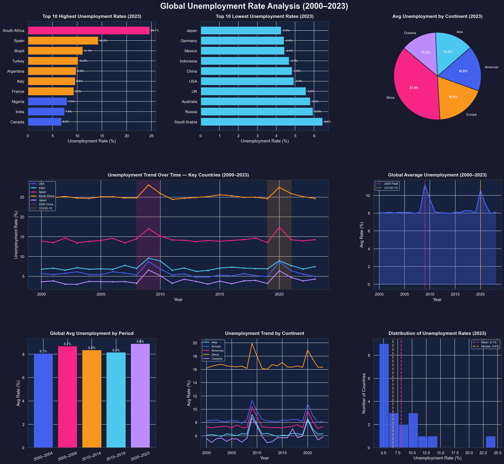

# 📊 Global Unemployment Rate Analysis (2000–2023)

### CodeAlpha Data Analytics Internship – Task 1

This project analyzes global unemployment trends from 2000 to 2023 using Python data analysis and visualization techniques. The objective is to understand unemployment patterns across countries and continents, identify economic impacts of major global events, and generate meaningful insights through an interactive dashboard.


## 📌 Project Overview

Unemployment is one of the most important economic indicators that reflects the health of a country's economy. This project analyzes unemployment rates across multiple countries and continents over two decades.

The analysis explores country-wise unemployment patterns, continental comparisons, historical trends, crisis impacts, and overall global unemployment behavior through a comprehensive dashboard.


## 🎯 Objectives

* Analyze unemployment trends across countries.
* Compare unemployment rates among continents.
* Identify countries with the highest and lowest unemployment rates.
* Study the impact of major global economic events.
* Examine historical unemployment patterns.
* Visualize unemployment distributions and trends.
* Generate meaningful economic insights through data visualization.


## 📊 Dataset Information

The dataset contains unemployment rate information for multiple countries from 2000 to 2023.

### Features Used

| Feature           | Description                            |
| ----------------- | -------------------------------------- |
| Country           | Country name                           |
| Year              | Year of observation                    |
| Unemployment Rate | Percentage of unemployed workforce     |
| Continent         | Geographic continent                   |
| Period            | Grouped time period for trend analysis |


## 📈 Analysis Performed

* Country-wise Unemployment Analysis
* Continent-wise Comparison
* Historical Trend Analysis
* Global Average Unemployment Analysis
* Economic Crisis Impact Analysis
* Period-wise Comparison
* Distribution Analysis
* Dashboard Visualization


## 📊 Dashboard Visualizations

The generated dashboard (`unemployment_visualization.png`) includes:

| Visualization                             | Purpose                                     |
| ----------------------------------------- | ------------------------------------------- |
| Top 10 Highest Unemployment Rates (2023)  | Identify countries with severe unemployment |
| Top 10 Lowest Unemployment Rates (2023)   | Identify countries with strong employment   |
| Average Unemployment by Continent (2023)  | Regional comparison                         |
| Unemployment Trend Over Time              | Historical analysis of key countries        |
| Global Average Unemployment               | Worldwide trend analysis                    |
| Global Average Unemployment by Period     | Long-term comparison                        |
| Unemployment Trend by Continent           | Regional trend analysis                     |
| Distribution of Unemployment Rates (2023) | Statistical distribution analysis           |


## 🔑 Key Findings

### 📈 Global Trends

* Global unemployment remained relatively stable between 2000 and 2023.
* Significant spikes occurred during major economic disruptions.
* The highest increases were observed during the 2008 Financial Crisis and COVID-19 pandemic.

### 🌍 Country Analysis

Countries with the highest unemployment rates in 2023 included:

* South Africa
* Spain
* Brazil
* Turkey
* Argentina

Countries with the lowest unemployment rates in 2023 included:

* Japan
* Germany
* Mexico
* Indonesia
* China

### 🌎 Continent Analysis

* Africa recorded the highest average unemployment rate.
* Europe and the Americas showed moderate unemployment levels.
* Asia maintained comparatively lower unemployment rates.
* Oceania demonstrated stable employment conditions over the years.

### 💹 Economic Crisis Impact

#### 2008 Global Financial Crisis

* Unemployment increased significantly across most countries.
* Global unemployment reached one of its highest levels during this period.

#### COVID-19 Pandemic (2020)

* A sharp increase in unemployment was observed worldwide.
* Most countries experienced temporary employment disruptions.

### 📊 Distribution Analysis

* The majority of countries maintained unemployment rates between 4% and 10%.
* A few countries acted as outliers with exceptionally high unemployment levels.


## 🛠 Technologies Used

* Python
* Pandas
* NumPy
* Matplotlib
* Seaborn
* Requests
* BeautifulSoup


## ⚙️ Installation

### Install Required Libraries

```bash
pip install pandas numpy matplotlib seaborn requests beautifulsoup4
```

---

## ▶️ How to Run

Execute the script:

```bash
python unemployment_data_scraping.py
```

The script will automatically:

1. Attempt to scrape unemployment data from Wikipedia.
2. Generate a historical unemployment dataset.
3. Perform statistical analysis.
4. Generate visualizations.
5. Create the unemployment dashboard.
6. Save the dashboard as `unemployment_visualization.png`.


## 📁 Project Structure

```text
Global_Unemployment_Analysis/
│
├── unemployment_data_scraping.py
├── unemployment_data.csv
├── unemployment_visualization.png
└── README.md
```


## 🖼 Output

<h2>📊 Global Unemployment Dashboard</h2>

<p align="center">
  
</p>


## 🚀 Future Enhancements

* Integrate real-world World Bank and ILO datasets.
* Develop interactive dashboards using Plotly and Streamlit.
* Perform unemployment forecasting using machine learning.
* Compare unemployment trends with GDP and inflation indicators.
* Build country-specific economic analysis dashboards.


## 👨‍💻 Author

**Penugonda Susmitha**

Bachelor of Technology (Computer Science and Engineering)

Sri Venkateswara College of Engineering

GitHub: https://github.com/Susmitha35-git


## 🙏 Acknowledgements

* CodeAlpha for providing the Data Analytics Internship opportunity.
* World Bank
* International Labour Organization (ILO)
* Wikipedia
* Python Open Source Community
* Data Science Community


## 📄 License

This project is intended for educational and internship purposes.


⭐ If you found this project useful, consider giving it a star.
